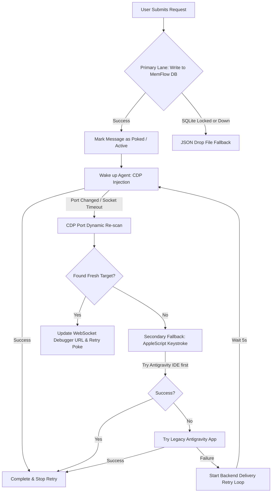

# Antigravity IDE vs. Antigravity/Vibe (Execution & Connection Scenarios)

This document describes how AG Bridge identifies, integrates, and maintains high-availability connections for the two types of Antigravity platforms:
1. **Antigravity IDE** (Modern workspace-integrated IDE tool)
2. **VibeCraft / Antigravity App** (Vibe - Legacy / Desktop workspace application)

---

## 1. Dynamic Product Detection

The bridge automatically distinguishes between the two environments on target scanning and background status loops:

* **Mechanism**:
  1. The bridge scans open listener ports using `lsof -i -nP` to find active HTTP debugging hosts.
  2. For each discovered process port, the bridge queries the process ID (PID) and inspects its launching arguments using:
     ```bash
     ps -p <PID> -o args=
     ```
  3. **Antigravity IDE**: Identified if the command includes `Antigravity IDE.app` or `antigravity-ide`.
  4. **Antigravity/Vibe**: Identified if the command includes `Antigravity.app`, `VibeCraft.app`, or contains `vibe` (case-insensitive).

* **Fallback**: Defaults to `ide` if PID scanning is unavailable or arguments are indeterminate.

---

## 2. Visual Status Indicators

To report connections clearly on the frontend:
* The dashboard header features a glowing glassmorphic badge placed just to the left of the active `Agent: [STATUS]` indicator.
* **IDE Badge**: Glows vibrant cyan (`#38bdf8`) labeled **IDE**.
* **Vibe Badge**: Glows bright pink (`#ec4899`) labeled **VIBE**.
* **State Sync**: The product type is broadcast in real-time over WebSockets (`agent_status`) and is fetched dynamically upon page refresh or server restamps via the `GET /agent/status` and `GET /status` endpoints.

---

## 3. High-Availability & Self-Healing Connection Flows

AG Bridge implements a multi-tiered connection maintenance and auto-recovery framework:



### Self-Healing Scenarios

#### Scenario A: The IDE Debugging Port Changes
* **Problem**: The IDE restarts, and Chromium allocates a brand-new dynamic remote-debugging port.
* **Auto-Correction**: When a `poke` fails due to a network error or connection timeout, the bridge does not crash. It automatically triggers `getTargets()`, re-scans the active processes, matches the active project workspace to the new port, and delivers the message seamlessly.

#### Scenario B: Stale WebSocket/TCP Zombie Connections (Client-side watchdog)
* **Problem**: Due to Wi-Fi state shifts or phone sleep cycles, the WebSocket remains in a zombie `OPEN` state without data flowing, or drops silently.
* **Auto-Correction**: The frontend runs a health checker watchdog (`pollHealth()`) every 10 seconds. If the WebSocket connection is broken or silent, but a lightweight HTTP ping to `/health` succeeds, the client **automatically bypasses standard backoffs and force-reestablishes the WebSocket stream** instantly.

#### Scenario C: Database Writes or CDP Failure (Server-side retry loop)
* **Problem**: The MemFlow database is temporarily locked and the IDE is completely unresponsive to DevTools.
* **Auto-Correction**: If message delivery fails completely across all primary and secondary routes, the bridge triggers an automated retry loop (`startRetry`). It will continuously attempt discovery, re-scanning, and delivery every 5 seconds (up to 24 times / 2 minutes) until connection or write persistence is restored.
