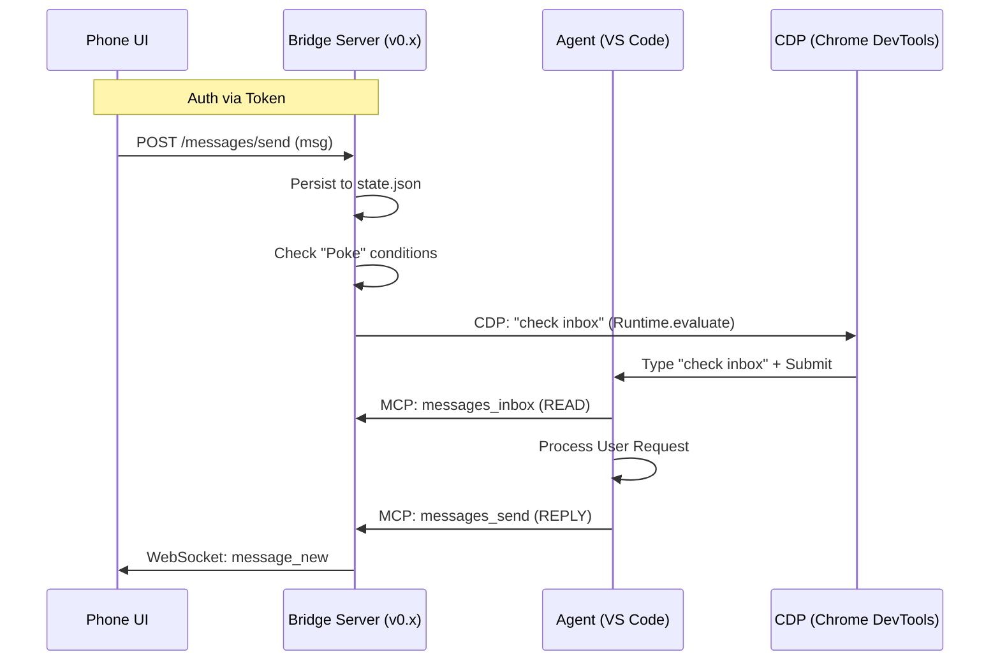

# AG Bridge Architecture

This document outlines the architecture of AG Bridge, a lightweight relay server connecting a Mobile UI to the Antigravity Agent running in VS Code.

## High-Level Flow

## Components

### 1. Bridge Server (`server.mjs`)
- **Role**: The central coordinator.
- **Stack**: Node.js + Express (HTTP) + `ws` (WebSocket) + `ws` (CDP Client).
- **Persistence**: `data/state.json` (Messages, Agent Status, Tokens), `data/approvals.json` (Approvals).
- **Security**: LAN-only, Token-based Auth (Headers: `x-ag-token`).

### 2. "The Poke" & Delivery Mechanisms (`connectors/`)
- **Role**: Remote wake-up and delivery mechanism for the Agent.
- **Mechanism**: Pluggable connector system (`index.mjs`) trying multiple pathways.
- **Delivery Flow**:
  1. **MemFlow (Primary)**: `memflow.mjs` directly writes the message to the local SQLite database (`~/.memflow/memflow.sqlite`). The Agent's normal preparation cycle automatically reads it. This bypasses the UI and CDP entirely.
  2. **CDP (Secondary / Wake-up)**: `antigravity.mjs` connects to the IDE via Chrome DevTools Protocol. It automatically discovers the debugging port (matching the `Antigravity IDE` or `Antigravity` process), finds the correct chat UI execution context, and injects the message.
  3. **AppleScript (Fallback)**: If CDP fails (e.g., cross-window environments), macOS AppleScript targets the process by name. It dynamically falls back from the new `"Antigravity IDE"` to the legacy `"Antigravity"` app to ensure backward compatibility.

### 3. MCP Server (`mcp-server.mjs`)
- **Role**: The interface for the Agent to interact with the outside world.
- **Transport**: Stdio (spawned by VS Code).
- **Tools**:
  - `messages_inbox`: Read pending messages.
  - `messages_send`: Reply to user.
  - `agent_heartbeat`: Update internal status/task.

### 4. Phone UI (`public/*`)
- **Role**: Mobile-first interface for the user.
- **Features**: Chat, Approvals Dashboard, Status Monitor.
- **Connectivity**: Local Wi-Fi (access via IP:Port).

## Security Model (v0.x)
- **Scope**: LAN Only (Home Network).
- **Trust**: Assumes secure local network.
- **Auth**: Pairing Code (initial) -> Persistent Token.
- **Policy**: `policy.json` validates sensitive commands (strict mode).

## Observability
- **Logs**: `.logs/ag-bridge-YYYY-MM-DD.log`
- **Status Endpoint**: `GET /status` (returns CDP, server, and agent health).
